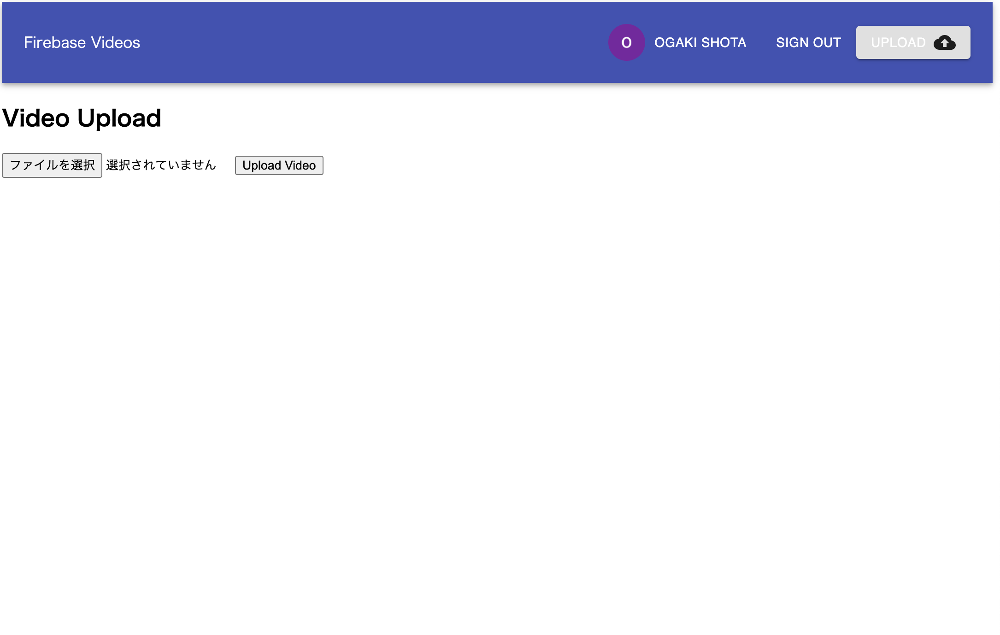

# youtube-like-app-react 
概要：reactを使用した動画アップロード、再生アプリケーションです。 
動画をアップロードするためにはログインが必要ですが、動画の再生には必要ありません 
また、データが永続化されるため、いつでも確認可能です。 
 

# 機能一覧： 
・googleログイン機能（firebase） 
・動画の永続化（firebase firestore） 
・動画アップロード機能（firebase firestore） 
・動画再生機能（video-react） 
・動画アップロード時ローディング機能（react-loading-overlay） 
・画面遷移機能（react） 
# ソフトウェア構成 
    @google-cloud/storage: 5.0.0 
    @material-ui/core: 4.9.13 
    @material-ui/icons: 4.9.1 
    @testing-library/jest-dom: 4.2.4 
    @testing-library/react: 9.5.0 
    @testing-library/user-event: 7.2.1 
    ffmpeg-static: 4.2.1 
    firebase: 7.14.3 
    firebase-admin: 8.12.0 
    firebase-functions: 3.6.1 
    react: 16.13.1 
    react-dom: 16.13.1 
    react-loading-overlay: 1.0.1 
    react-router-dom: 5.2.0 
    react-scripts: 3.4.1 
    uuid-v4: 0.1.0 
    video-react: 0.14.1
    @ffmpeg-installer/ffmpeg: 1.0.13 
    bufferutil: 4.0.1 
    fibers: 5.0.0 
    fluent-ffmpeg: 2.1.2 
    node-sass: 4.14.1 
    sass: 1.26.5 
    typescript: 3.8.3 
    utf-8-validate: 5.0.2
